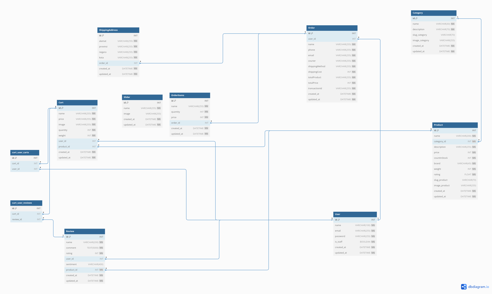
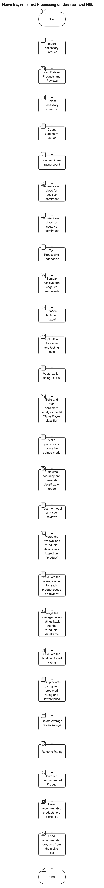

### Ecommerce: Sistem Rekomendasi Produk E-commerce Berdasarkan Analisis Sentimen Ulasan Pengguna dan Rating

Dalam konteks industri e-commerce yang semakin berkembang pesat, keputusan pembelian seringkali dipengaruhi oleh ulasan pengguna dan peringkat produk. Sebagian besar pelanggan cenderung mencari pandangan dan pengalaman pengguna lain sebelum mereka memutuskan untuk membeli produk tertentu. Oleh karena itu, menganalisis sentimen ulasan pengguna dan peringkat produk menjadi aspek yang sangat penting dalam mengoptimalkan pengalaman pelanggan dan kesuksesan bisnis.

### Database Proyek akhir

### Alur Model

