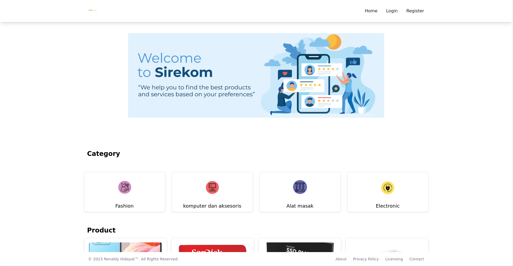

## Overview

This project is an E-commerce frontend built using modern web development technologies such as React, React-Redux, Redux Toolkit, Flowbite, Tailwind CSS, and other complementary tools. It provides an intuitive and seamless user interface for browsing products, managing user accounts, handling orders, and facilitating a smooth checkout process.

## Key Features

### 1. React-Based Structure
Utilizes React, a powerful JavaScript library for building user interfaces, providing a robust foundation for creating reusable components and managing complex application states.

### 2. React-Redux Integration
Incorporates React-Redux, enabling efficient state management and seamless integration between React components and Redux store, ensuring a predictable data flow throughout the application.

### 3. Redux Toolkit for State Management
Leverages Redux Toolkit to streamline the implementation of Redux by simplifying setup, reducing boilerplate code, and offering tools for efficient state management.

### 4. UI Framework: Flowbite and Tailwind CSS
Employs Flowbite and Tailwind CSS, two versatile and customizable UI frameworks, to create responsive, modern, and visually appealing user interfaces.

### 5. Routing with React Router DOM
Utilizes React Router DOM for navigation and routing within the application, ensuring smooth transitions between different pages and components.

### 6. User Authentication and Authorization
Integrates an authentication provider to manage user sessions, allowing users to register, log in, and access personalized features like user profiles, order history, and cart management.

## Getting Started

To get started with this project:

1. **Clone the Repository**: Get a copy of the project repository on your local machine.
2. **Install Dependencies**: Run `npm install` or `yarn install` to install all necessary dependencies.
3. **Run the Development Server**: Use `npm start` or `yarn start` to launch the application locally.
4. **Explore and Contribute**: Navigate through different functionalities, and feel free to contribute by raising issues or making enhancements.

This E-commerce frontend offers a solid foundation for building an interactive and efficient online shopping experience, providing a customizable and scalable solution for various business needs.

## Demo

