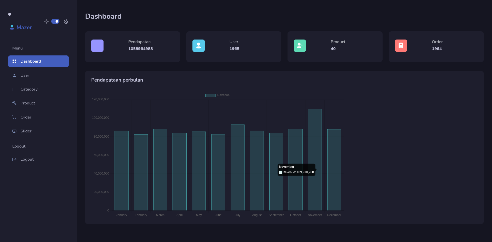

## Overview

The Admin Frontend is a React-based interface designed for administrative tasks, leveraging React, React-Redux, Redux Toolkit, Bootstrap, Mazer Dashboard, and Tauri. It facilitates seamless management and administration of various functionalities like categories, products, orders, sliders, and users within an intuitive dashboard.

## Key Components

### 1. React and Redux
Utilizes React, a JavaScript library for building user interfaces, and integrates React-Redux for efficient state management, ensuring a predictable data flow across the application.

### 2. Redux Toolkit
Leverages Redux Toolkit, providing simplified configuration and tools for efficient state management within the React application.

### 3. Bootstrap for UI
Integrates Bootstrap, a popular CSS framework, to design responsive and sleek user interfaces for administrative functionalities.

### 4. Mazer Dashboard
Utilizes the Mazer Dashboard template to create a visually appealing and functional administrative interface with pre-designed components and layouts.

### 5. Tauri Integration
Integration with Tauri facilitates the creation of desktop applications using web technologies, enabling a desktop version of the admin interface.

## Routes and Functionality

- **/admin/category**: Manages product categories.
- **/admin/category/edit/:id**: Allows editing of specific product categories.
- **/admin/product**: Handles product management.
- **/admin/product/edit/:id**: Permits editing of individual products.
- **/admin/order**: Manages orders within the system.
- **/admin/slider**: Controls slider functionalities.
- **/admin/slider/edit/:id**: Edits specific sliders.
- **/admin/user**: Handles user management.
- **/admin/user/edit/:id**: Allows editing of user details.
- **/admin**: Accesses the main admin dashboard.

## Usage and Setup

1. **Installation**: Ensure required dependencies are installed via npm or yarn.
2. **Routing Configuration**: Customize routes and layouts as per specific administrative needs.
3. **Exploration and Customization**: Utilize Mazer Dashboard components and React-Redux features to tailor the admin interface.

## Demo

