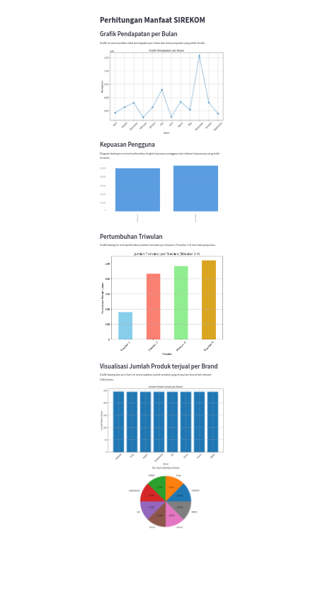

## Overview
This Streamlit-based application is designed to analyze and visualize various aspects of sales data from the SIREKOM system. It provides insights into key metrics, including monthly revenue trends, user satisfaction levels, quarterly growth, and brand-wise product sales.

## Features
- **Monthly Revenue Visualization:** Displays a line chart illustrating the total revenue per month based on processed sales data.
- **User Satisfaction Analysis:** Presents a bar chart showcasing user satisfaction levels from the available dataset.
- **Quarterly Growth Graph:** Depicts the transaction count per quarter for the year 2023, showcasing quarterly growth.
- **Brand-Wise Product Sales:** Provides insights into the sales distribution among different brands through both bar and pie charts.

## Data Sources
The application utilizes various datasets:
- `modified_order.csv`: Contains modified sales order data.
- `kepuasaan.csv`: Holds user satisfaction data.
- `OrderItems_with_brand.csv`: Includes information on order items and their respective brands.

## Requirements
To run this application locally, ensure you have:
- Python 3.6 or later
- Necessary Python libraries mentioned in `requirements.txt`
- Access to the provided datasets stored in the `./dataset` directory.

## Getting Started
1. Clone this repository to your local machine.
2. Install the required dependencies by running `pip install -r requirements.txt`.
3. Ensure the datasets (`modified_order.csv`, `kepuasaan.csv`, `OrderItems_with_brand.csv`) are placed in the `./dataset` directory.
4. Run the app using Streamlit: `streamlit run app.py`.

## Usage
- Upon running the app, it will display various visualizations under different sections, providing insights into SIREKOM's sales data.
- Explore each section to gain a deeper understanding of sales performance, user satisfaction, and product distribution.

## Demo

